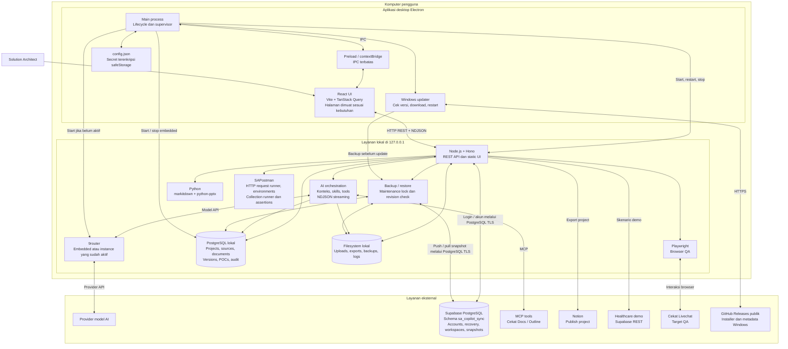
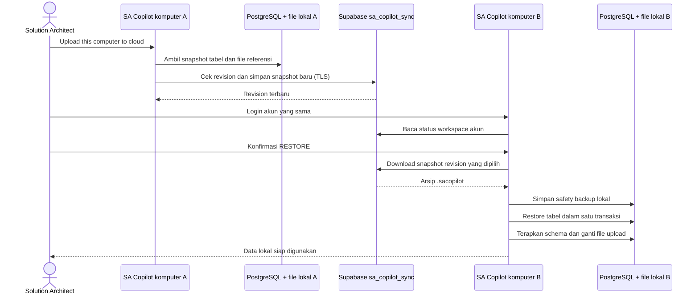

# Arsitektur SA Copilot

Diagram berdasarkan implementasi kode pada 7 Oktober 2026. Nilai rahasia dan URL koneksi lengkap tidak disertakan.

## Arsitektur runtime

## Perpindahan data antar komputer

## Keputusan arsitektur

- Windows terinstal memakai `electron-updater` dan GitHub Releases publik. Update memasang versi baru setelah safety backup dan shutdown layanan; detail di `windows-auto-update.md`.
- SAPostman mengimpor cURL dan menerima payload dari use case POC/n8n. Collection, environment, endpoint, dokumentasi, versi, dan riwayat kirim disimpan di PostgreSQL serta ikut backup. Variable memiliki scope collection/environment/API; runner meneruskan hasil extraction hanya selama run. Auth dihapus dari snapshot riwayat; endpoint yang sengaja disimpan mencakup auth. Request dijalankan setelah Hit / Send, dengan timeout 1–120 detik, respons maksimal 2 MB, dan redirect manual. AI memberi saran yang direview sebelum diterapkan; detail di `sapostman.md`.
- Database kerja utama berada di komputer pengguna. Supabase menyimpan akun dan snapshot backup untuk perpindahan antar komputer; transfer snapshot dilakukan secara manual dengan pemeriksaan revision.
- Akses cloud menggunakan koneksi PostgreSQL melalui TLS dengan verifikasi sertifikat. Integrasi healthcare demo menggunakan Supabase REST yang terpisah.
- Endpoint cloud memakai workspace `account:<account.id>`. Walaupun `CLOUD_WORKSPACE` masih dibaca konfigurasi, route cloud yang membutuhkan login menggunakan workspace akun tersebut.
- Mode desktop menerima konfigurasi dari Electron `config.json` melalui environment child process. Mode source membaca `.env`; mengubah `.env` tidak otomatis mengubah konfigurasi desktop.
- Electron mengelola Postgres, router, dan server. Pada mode source, browser mengakses server lokal dan PostgreSQL/9router dijalankan terpisah. Port desktop dipilih dinamis.
- UI tidak mengakses database atau kredensial cloud secara langsung. Pengaturan desktop melewati preload IPC dengan `contextIsolation`, sandbox, dan tanpa Node integration.
- Versi dokumen dan POC baru ditambahkan sebagai riwayat. Restore versi tidak mengganti riwayat lama.
- Backup cloud mencakup tabel dan upload yang direferensikan, maksimal 100 MB per snapshot, dengan retensi sepuluh revision. Konfigurasi koneksi perangkat tidak ikut dipindahkan.

Secret vault SAPostman menyimpan nilai di file lokal terenkripsi AES-256-GCM dengan key dari password via scrypt. File vault berada di luar snapshot database/uploads dan tidak ikut cloud backup; endpoint menyimpan referensi `{{vault.name}}`. Resolve dilakukan server saat Send/Preview; preview menyamarkan nilai. Cancel request memakai AbortController pada server, termasuk saat membaca response.

## Referensi implementasi

| Bagian | Source |
| --- | --- |
| Desktop dan lifecycle | `electron/main.ts`, `electron/services/server.ts`, `electron/services/postgres.ts`, `electron/services/router9.ts` |
| Config dan IPC | `electron/config.ts`, `electron/preload.ts`, `electron/bridge.ts` |
| Server dan route | `server/index.ts`, `server/routes.ts` |
| AI dan konteks | `server/ai/handler.ts`, `server/ai/context.ts`, `server/ai/mcp.ts` |
| Database lokal | `server/db.ts`, `db/schema.sql` |
| Backup dan sinkronisasi | `server/backup/service.ts`, `server/maintenance/cloud.ts`, `server/maintenance/routes.ts` |
| Akun cloud | `server/auth.ts`, `server/accountRecovery.ts`, `db/supabase-sync.sql` |
| UI dan pemuatan halaman | `src/App.tsx`, `src/components/Layout.tsx` |
