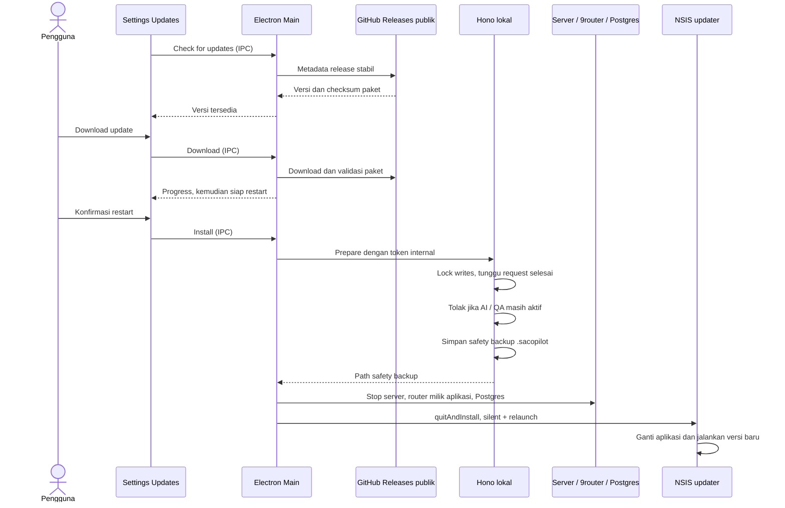

# Auto-update Windows

## Penggunaan

Installer **2.1.1** adalah versi pertama yang membawa updater. Install versi ini satu kali untuk menggantikan versi sebelumnya. Setelah itu gunakan **Settings → Updates → Check for updates → Download update → Restart to update**.

Aplikasi terinstal memeriksa release stabil saat startup (setelah 30 detik) dan setiap empat jam. Download hanya dimulai ketika pengguna memilihnya. Menutup aplikasi biasa tidak otomatis memasang update. Mode `npm run desktop` dan macOS menampilkan keterangan bahwa update Windows hanya tersedia pada aplikasi Windows terinstal.

## Arsitektur

Jika backup gagal, update batal tanpa menghentikan server. Jika shutdown atau installer gagal, aplikasi mencoba memulihkan layanan lokal. Backup tetap disimpan di folder data pengguna. Data dan config tidak berada dalam folder aplikasi yang diganti oleh installer.

## Release berikutnya

1. Pastikan repo `ceguyyy/sa-copilot` publik. Tidak ada token GitHub yang dibundel atau diberikan ke renderer.
2. Naikkan versi `package.json` dan `package-lock.json` (`npm version patch` atau versi yang diinginkan).
3. Commit perubahan dan push tag yang sesuai, misalnya `v2.1.2`.
4. Workflow **Installers** menjalankan build dan tes. Windows mengunggah `.exe`, `.exe.blockmap`, dan `latest.yml` ke GitHub Release bersama artifact macOS yang sudah ada.
5. Publish sebagai release stabil. Pengguna Windows kemudian bisa memperbarui dari aplikasi.

`electron-builder.yml` memakai provider GitHub khusus Windows. `app-update.yml` di dalam resources installer menunjuk ke repo yang sama. Build lokal memakai `--publish never`, jadi membuat installer tidak otomatis mengunggah atau memublikasikannya.

## Verifikasi sebelum release

- `npm test`, `npm run lint`, `npm run typecheck`.
- `npm run dist:win`; pastikan `release/latest.yml` menyebut versi dan nama installer yang benar.
- Install ke profil data percobaan, buka Settings → Updates, dan periksa versi/state updater.
- Untuk tes update penuh, install versi updater lama di profil percobaan lalu sediakan release stabil yang lebih baru. Uji download, backup, shutdown, restart, dan keutuhan data. Tes alur ini tidak bisa dibuktikan hanya dengan mock event updater.
- Paket saat ini mengikuti konfigurasi installer unsigned yang sudah ada. HTTPS dan checksum updater dipakai; tidak ada klaim validasi Authenticode pada paket unsigned. Jika sertifikat Windows tersedia, gunakan code signing di pipeline dan pertahankan verifikasi signature bawaan updater.

## Hasil validasi 7 Oktober 2026

- `npm test`: 463 passed, 13 skipped (tes integrasi dengan layanan terpisah).
- `npm run typecheck`, `npm run lint`, dan `npm run dist:win`: berhasil.
- Smoke test binary Windows terpaket pada profil data percobaan: versi 2.1.1, updater tersedia, health API berhasil, install sebelum download ditolak, endpoint backup internal tanpa token ditolak.
- `SA-Copilot-Setup-2.1.1.exe`, `.exe.blockmap`, dan `latest.yml`: versi, nama file, ukuran, serta SHA-512 cocok. Nama artifact tanpa spasi dipakai supaya URL metadata sama dengan nama asset release.
- Repo aplikasi sudah publik sesuai persetujuan pengguna. Release 2.1.1 belum dipublikasikan saat validasi ini dilakukan. Update lintas dua versi belum diuji end-to-end.

## Source

`electron/updates.ts`, `electron/main.ts`, `electron/bridge.ts`, `electron/preload.ts`, `server/maintenance/desktopUpdate.ts`, `server/maintenance/lock.ts`, `src/pages/settings/UpdatesSettings.tsx`, `electron-builder.yml`, `.github/workflows/installers.yml`.

Referensi: [electron-builder auto-update](https://www.electron.build/v26/docs/features/auto-update/).
